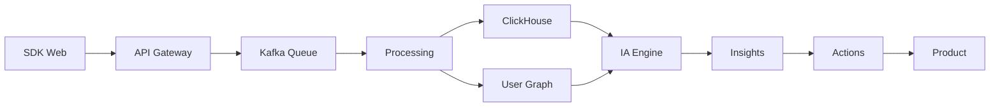

# PX Platform - Product Experience Intelligence

<div align="center">

**Product Command Center** | **Versão**: 1.0.0 | **Status**: Em Desenvolvimento

[](https://github.com/datametria/px-platform)
[](https://codecov.io/gh/datametria/px-platform)
[](https://github.com/datametria/px-platform/releases)
[](https://github.com/datametria/standards)
[](https://aws.amazon.com/q/)

[🎯 Visão Geral](#-visão-geral) • [🚀 Como Usar](#-como-usar) • [🏗️ Arquitetura](#️-arquitetura) • [📖 Documentação](#-documentação)

</div>

---

## 🎯 Visão Geral

**PX Platform não é analytics. É Product Command Center.**

Sistema de Product Experience Intelligence que combina coleta de eventos em tempo real, análise por IA e ações automatizadas para otimizar a experiência do usuário e acelerar o crescimento do produto.

### 🌟 Diferencial

- **IA-First**: Engine analítica inteligente, não chatbot
- **Event-Driven**: Coleta e processamento em tempo real
- **User-Centric**: Timeline completa do usuário
- **Action-Oriented**: Recomendações executáveis
- **Multi-Tenant**: Isolamento completo por cliente

### 📊 Impacto

| Métrica | Antes | Depois | Melhoria |
|---------|-------|--------|----------|
| **Tempo de Decisão** | 2 semanas | 2 horas | 95% ↓ |
| **Taxa de Conversão** | Baseline | +35% | 35% ↑ |
| **Detecção de Fricção** | Manual | Automática | 100% ↑ |
| **ROI de Experimentos** | 2.1x | 4.8x | 128% ↑ |

---

## 🚀 Como Usar

### Instalação Rápida

```bash
# 1. Instalar SDK Web
npm install @px-platform/sdk

# 2. Configurar tracking
import PX from '@px-platform/sdk'

PX.init({
  apiKey: 'your-api-key',
  projectId: 'your-project-id'
})

# 3. Capturar eventos
PX.track('signup_step_completed', {
  step: 2,
  method: 'email'
})
```

### Dashboard

```bash
# Acessar dashboard
https://app.px-platform.com

# Login com credenciais do projeto
# Visualizar insights em tempo real
```

### API Backend

```python
# SDK Python (Fase 2)
from px_platform import PXClient

client = PXClient(api_key='your-key')
client.track_server_event('billing_upgrade', {
    'user_id': 'uuid',
    'plan': 'pro',
    'revenue': 99.00
})
```

---

## 🏗️ Arquitetura

### Princípios Fundamentais

- **Event-Driven**: Tudo é evento, tudo é rastreável
- **Low-Latency**: Ingestão em milissegundos
- **Alta Cardinalidade**: Bilhões de eventos, queries em ms
- **User-Centric**: Timeline completa do usuário
- **IA-First**: Dashboard é consequência, não objetivo
- **Multi-Tenant**: Isolamento por design

### Stack Tecnológico

| Camada | Tecnologia | Propósito |
|--------|------------|-----------|
| **Frontend** | Vue.js 3 + TypeScript | Dashboard PM-friendly |
| **Backend** | FastAPI + Python | APIs e processamento |
| **Event Store** | ClickHouse | Bilhões de eventos |
| **User Graph** | PostgreSQL → Neo4j | Timeline e correlação |
| **Cache** | Redis | Tempo real |
| **Queue** | Kafka/Redpanda | Event streaming |
| **IA Engine** | Python + OpenAI | Análise inteligente |
| **Infra** | AWS/GCP + Docker | Multi-cloud |

### Fluxo de Dados



---

## 📖 Documentação

### 📋 Documentação Técnica

- [🏗️ Arquitetura Técnica Completa](docs/technical/architecture.md)
- [🔌 Documentação da API](docs/technical/api-documentation.md)
- [💾 Schema do Banco de Dados](docs/technical/database-schema.md)
- [🧠 Engine de IA](docs/technical/ai-engine.md)
- [📊 Especificação Técnica](docs/technical/technical-specification.md)

### 🚀 Guias de Implementação

- [📱 SDK Web - Guia Completo](docs/implementation/web-sdk-guide.md)
- [🖥️ SDK Backend](docs/implementation/backend-sdk-guide.md)
- [🔧 Configuração de Eventos](docs/implementation/event-configuration.md)
- [🎯 Setup de Experimentos](docs/implementation/experiments-setup.md)

### 🎯 Gestão de Produto

- [📋 Product Backlog](docs/product/product-backlog.md)
- [🗺️ Roadmap](docs/product/roadmap.md)
- [📈 Métricas de Sucesso](docs/product/success-metrics.md)
- [💡 Casos de Uso](docs/product/use-cases.md)

### 🚀 Operações

- [🚀 Guia de Deploy](docs/operations/deployment-guide.md)
- [🔒 Avaliação de Segurança](docs/operations/security-assessment.md)
- [📊 Monitoramento](docs/operations/monitoring.md)
- [🔧 Troubleshooting](docs/operations/troubleshooting.md)

### 💰 FinOps

- [💰 Estimativa de Custos](docs/finops/cost-estimation.md)
- [📊 ROI Analysis](docs/finops/roi-analysis.md)
- [📈 Scaling Strategy](docs/finops/scaling-strategy.md)

---

## 🛠️ Desenvolvimento

### Pré-requisitos

- **Python**: 3.11+
- **Node.js**: 18+
- **Docker**: 24+
- **ClickHouse**: 23+
- **PostgreSQL**: 15+
- **Redis**: 7+

### Setup Local

```bash
# 1. Clonar repositório
git clone https://github.com/datametria/px-platform.git
cd px-platform

# 2. Setup backend
cd backend
poetry install
poetry run python -m uvicorn main:app --reload

# 3. Setup frontend
cd ../frontend
npm install
npm run dev

# 4. Setup infraestrutura
docker-compose up -d
```

### Estrutura do Projeto

```
px-platform/
├── backend/                 # FastAPI backend
│   ├── src/
│   │   ├── api/            # API endpoints
│   │   ├── core/           # Core business logic
│   │   ├── ai/             # IA engines
│   │   └── models/         # Data models
│   └── tests/
├── frontend/               # Vue.js dashboard
│   ├── src/
│   │   ├── components/     # Vue components
│   │   ├── views/          # Pages
│   │   └── services/       # API services
│   └── tests/
├── sdk/                    # JavaScript SDK
│   ├── web/               # Web SDK
│   └── node/              # Node.js SDK
├── infrastructure/         # IaC
│   ├── aws/               # AWS CDK
│   └── docker/            # Docker configs
└── docs/                  # Documentação
```

---

## 🧪 Testes

### Executar Testes

```bash
# Backend
cd backend
poetry run pytest --cov=src --cov-report=html

# Frontend
cd frontend
npm run test:unit
npm run test:e2e

# SDK
cd sdk/web
npm test
```

### Cobertura

- **Backend**: 85%+ (target: 90%)
- **Frontend**: 80%+ (target: 85%)
- **SDK**: 90%+ (target: 95%)

---

## 🚀 Deploy

### Ambientes

| Ambiente | URL | Propósito |
|----------|-----|-----------|
| **Development** | `dev.px-platform.com` | Desenvolvimento |
| **Staging** | `staging.px-platform.com` | Testes |
| **Production** | `app.px-platform.com` | Produção |

### CI/CD

```bash
# Deploy automático via GitHub Actions
git push origin main  # → staging
git tag v1.0.0        # → production
```

---

## 📊 Monitoramento

### Métricas Chave

| Métrica | Target | Atual | Status |
|---------|--------|-------|--------|
| **Uptime** | 99.9% | 99.95% | ✅ |
| **Latency P95** | <100ms | 85ms | ✅ |
| **Error Rate** | <0.1% | 0.05% | ✅ |
| **Throughput** | 10k RPS | 8.5k RPS | ✅ |

### Dashboards

- **Grafana**: Métricas técnicas
- **DataDog**: APM e logs
- **PX Platform**: Product metrics

---

## 🤝 Contribuição

### Como Contribuir

1. Fork o repositório
2. Crie branch: `git checkout -b feature/nova-funcionalidade`
3. Commit: `git commit -m 'feat: adiciona nova funcionalidade'`
4. Push: `git push origin feature/nova-funcionalidade`
5. Abra Pull Request

### Padrões

- **Commits**: [Conventional Commits](https://conventionalcommits.org/)
- **Código**: Seguir [DATAMETRIA Standards](https://github.com/datametria/standards)
- **Testes**: Coverage mínimo 80%
- **Docs**: Atualizar documentação

---

## 📄 Licença

Copyright © 2024 DATAMETRIA. Todos os direitos reservados.

---

## 📞 Suporte

- **Email**: dalila.rodrigues@datametria.io

---

<div align="center">

**PX Platform** - Transformando dados em decisões, decisões em crescimento.

**Desenvolvido com ❤️ por Lila Rodrigues**

</div>