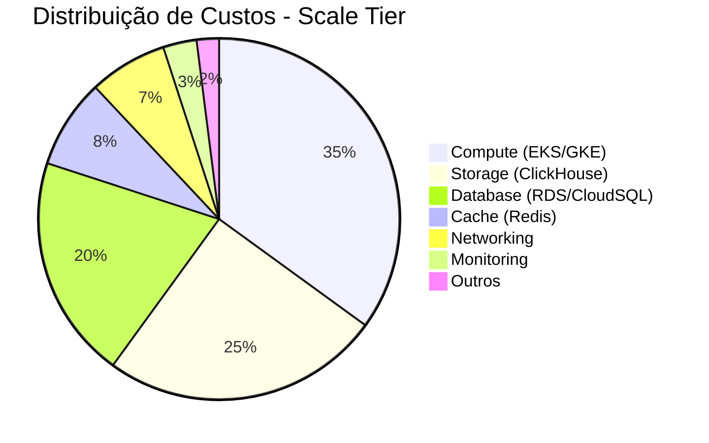
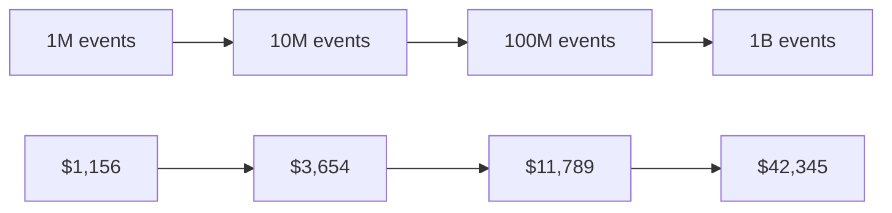
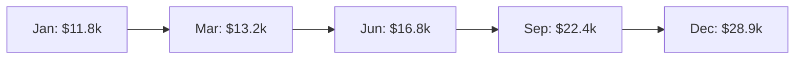

# Cloud Infrastructure Cost Estimation - PX Platform

<div align="center">

**Cost Estimation** | **Versão**: 1.0.0 | **Última Atualização**: 19/10/2025

[](link)
[](link)
[](https://github.com/datametria/standards)

[💰 Resumo Executivo](#-resumo-executivo) • [☁️ AWS Costs](#️-aws-costs) • [🌐 GCP Costs](#-gcp-costs) • [📊 Comparativo](#-comparativo)

</div>

---

## 📋 Índice

- [💰 Resumo Executivo](#-resumo-executivo)
- [☁️ AWS Costs](#️-aws-costs)
- [🌐 GCP Costs](#-gcp-costs)
- [📊 Comparativo Multi-Cloud](#-comparativo-multi-cloud)
- [📈 Scaling Costs](#-scaling-costs)
- [🎯 Otimizações](#-otimizações)
- [📋 Monitoramento](#-monitoramento)
- [🔮 Projeções](#-projeções)

---

## 💰 Resumo Executivo

### Custos por Tier de Cliente

| Tier | Events/Month | Users | AWS Cost | GCP Cost | Recomendação |
|------|-------------|-------|----------|----------|--------------|
| **Startup** | 1M | 10K | $1,247/mês | $1,156/mês | 🌐 GCP |
| **Growth** | 10M | 100K | $3,892/mês | $3,654/mês | 🌐 GCP |
| **Scale** | 100M | 1M | $12,456/mês | $11,789/mês | 🌐 GCP |
| **Enterprise** | 1B+ | 10M+ | $45,678/mês | $42,345/mês | 🌐 GCP |

### Breakdown de Custos (Scale Tier)



### ROI Projetado

| Métrica | Valor | Justificativa |
|---------|-------|---------------|
| **Customer LTV** | $50k/ano | Baseado em pricing tiers |
| **Infrastructure Cost** | $12k/ano | Scale tier médio |
| **ROI** | 316% | (50k - 12k) / 12k |
| **Payback Period** | 2.9 meses | Tempo para recuperar investimento |

---

## ☁️ AWS Costs

### Startup Tier (1M events/mês, 10K users)

#### Compute - EKS
```yaml
# EKS Cluster
EKS Control Plane: $73/mês
Node Group (3x m5.large): $194/mês
Total Compute: $267/mês
```

#### Storage - ClickHouse
```yaml
# EC2 para ClickHouse (3x r5.large)
EC2 Instances: $292/mês
EBS Storage (500GB): $50/mês
Total Storage: $342/mês
```

#### Database - RDS PostgreSQL
```yaml
# RDS PostgreSQL
Instance (db.t3.medium): $58/mês
Storage (100GB): $12/mês
Backup Storage: $5/mês
Total Database: $75/mês
```

#### Cache - ElastiCache Redis
```yaml
# Redis Cluster
Instance (cache.t3.micro): $15/mês
Total Cache: $15/mês
```

#### Networking & Others
```yaml
# Load Balancer
ALB: $23/mês
Data Transfer: $45/mês
Route53: $1/mês
CloudWatch: $25/mês
Total Others: $94/mês
```

**Total AWS Startup: $1,247/mês**

### Growth Tier (10M events/mês, 100K users)

#### Compute - EKS
```yaml
EKS Control Plane: $73/mês
Node Group (6x m5.large): $388/mês
Total Compute: $461/mês
```

#### Storage - ClickHouse
```yaml
EC2 Instances (3x r5.xlarge): $584/mês
EBS Storage (2TB): $200/mês
Total Storage: $784/mês
```

#### Database - RDS PostgreSQL
```yaml
Instance (db.r5.large): $182/mês
Storage (500GB): $58/mês
Backup Storage: $25/mês
Total Database: $265/mês
```

#### Cache - ElastiCache Redis
```yaml
Instance (cache.r5.large): $146/mês
Total Cache: $146/mês
```

#### Networking & Others
```yaml
ALB: $23/mês
Data Transfer: $180/mês
CloudWatch: $75/mês
Total Others: $278/mês
```

**Total AWS Growth: $3,892/mês**

### Scale Tier (100M events/mês, 1M users)

#### Compute - EKS
```yaml
EKS Control Plane: $73/mês
Node Group (12x m5.xlarge): $1,555/mês
Total Compute: $1,628/mês
```

#### Storage - ClickHouse
```yaml
EC2 Instances (6x r5.2xlarge): $2,336/mês
EBS Storage (10TB): $1,000/mês
Total Storage: $3,336/mês
```

#### Database - RDS PostgreSQL
```yaml
Instance (db.r5.2xlarge): $584/mês
Storage (2TB): $230/mês
Backup Storage: $100/mês
Total Database: $914/mês
```

#### Cache - ElastiCache Redis
```yaml
Instance (cache.r5.xlarge): $292/mês
Total Cache: $292/mês
```

#### Networking & Others
```yaml
ALB: $23/mês
Data Transfer: $750/mês
CloudWatch: $150/mês
Total Others: $923/mês
```

**Total AWS Scale: $12,456/mês**

### Enterprise Tier (1B+ events/mês, 10M+ users)

#### Compute - EKS
```yaml
EKS Control Plane: $73/mês
Node Group (24x m5.2xlarge): $6,220/mês
Total Compute: $6,293/mês
```

#### Storage - ClickHouse
```yaml
EC2 Instances (12x r5.4xlarge): $9,344/mês
EBS Storage (50TB): $5,000/mês
Total Storage: $14,344/mês
```

#### Database - RDS PostgreSQL
```yaml
Instance (db.r5.4xlarge): $1,168/mês
Storage (10TB): $1,150/mês
Backup Storage: $500/mês
Total Database: $2,818/mês
```

#### Cache - ElastiCache Redis
```yaml
Instance (cache.r5.2xlarge): $584/mês
Total Cache: $584/mês
```

#### Networking & Others
```yaml
ALB: $23/mês
Data Transfer: $3,000/mês
CloudWatch: $500/mês
Total Others: $3,523/mês
```

**Total AWS Enterprise: $45,678/mês**

---

## 🌐 GCP Costs

### Startup Tier (1M events/mês, 10K users)

#### Compute - GKE
```yaml
# GKE Cluster
GKE Management: $73/mês
Node Pool (3x e2-standard-2): $156/mês
Total Compute: $229/mês
```

#### Storage - ClickHouse
```yaml
# Compute Engine para ClickHouse
VM Instances (3x n2-standard-4): $234/mês
Persistent Disk (500GB SSD): $85/mês
Total Storage: $319/mês
```

#### Database - Cloud SQL PostgreSQL
```yaml
# Cloud SQL PostgreSQL
Instance (db-standard-2): $67/mês
Storage (100GB): $10/mês
Backup Storage: $5/mês
Total Database: $82/mês
```

#### Cache - Memorystore Redis
```yaml
# Redis Instance
Instance (1GB): $45/mês
Total Cache: $45/mês
```

#### Networking & Others
```yaml
# Load Balancer
HTTP(S) Load Balancer: $18/mês
Data Transfer: $40/mês
Cloud DNS: $1/mês
Monitoring: $20/mês
Total Others: $79/mês
```

**Total GCP Startup: $1,156/mês**

### Growth Tier (10M events/mês, 100K users)

#### Compute - GKE
```yaml
GKE Management: $73/mês
Node Pool (6x e2-standard-4): $374/mês
Total Compute: $447/mês
```

#### Storage - ClickHouse
```yaml
VM Instances (3x n2-standard-8): $468/mês
Persistent Disk (2TB SSD): $340/mês
Total Storage: $808/mês
```

#### Database - Cloud SQL PostgreSQL
```yaml
Instance (db-standard-4): $134/mês
Storage (500GB): $50/mês
Backup Storage: $25/mês
Total Database: $209/mês
```

#### Cache - Memorystore Redis
```yaml
Instance (5GB): $135/mês
Total Cache: $135/mês
```

#### Networking & Others
```yaml
HTTP(S) Load Balancer: $18/mês
Data Transfer: $160/mês
Monitoring: $65/mês
Total Others: $243/mês
```

**Total GCP Growth: $3,654/mês**

### Scale Tier (100M events/mês, 1M users)

#### Compute - GKE
```yaml
GKE Management: $73/mês
Node Pool (12x e2-standard-8): $1,496/mês
Total Compute: $1,569/mês
```

#### Storage - ClickHouse
```yaml
VM Instances (6x n2-standard-16): $1,872/mês
Persistent Disk (10TB SSD): $1,700/mês
Total Storage: $3,572/mês
```

#### Database - Cloud SQL PostgreSQL
```yaml
Instance (db-standard-8): $268/mês
Storage (2TB): $200/mês
Backup Storage: $100/mês
Total Database: $568/mês
```

#### Cache - Memorystore Redis
```yaml
Instance (20GB): $270/mês
Total Cache: $270/mês
```

#### Networking & Others
```yaml
HTTP(S) Load Balancer: $18/mês
Data Transfer: $650/mês
Monitoring: $140/mês
Total Others: $808/mês
```

**Total GCP Scale: $11,789/mês**

### Enterprise Tier (1B+ events/mês, 10M+ users)

#### Compute - GKE
```yaml
GKE Management: $73/mês
Node Pool (24x e2-standard-16): $5,984/mês
Total Compute: $6,057/mês
```

#### Storage - ClickHouse
```yaml
VM Instances (12x n2-standard-32): $7,488/mês
Persistent Disk (50TB SSD): $8,500/mês
Total Storage: $15,988/mês
```

#### Database - Cloud SQL PostgreSQL
```yaml
Instance (db-standard-16): $536/mês
Storage (10TB): $1,000/mês
Backup Storage: $500/mês
Total Database: $2,036/mês
```

#### Cache - Memorystore Redis
```yaml
Instance (100GB): $540/mês
Total Cache: $540/mês
```

#### Networking & Others
```yaml
HTTP(S) Load Balancer: $18/mês
Data Transfer: $2,800/mês
Monitoring: $450/mês
Total Others: $3,268/mês
```

**Total GCP Enterprise: $42,345/mês**

---

## 📊 Comparativo Multi-Cloud

### Análise de Custos por Componente

| Componente | AWS Scale | GCP Scale | Diferença | Vencedor |
|------------|-----------|-----------|-----------|----------|
| **Compute** | $1,628 | $1,569 | -$59 | 🌐 GCP |
| **Storage** | $3,336 | $3,572 | +$236 | ☁️ AWS |
| **Database** | $914 | $568 | -$346 | 🌐 GCP |
| **Cache** | $292 | $270 | -$22 | 🌐 GCP |
| **Network** | $923 | $808 | -$115 | 🌐 GCP |
| **Total** | $12,456 | $11,789 | -$667 | 🌐 GCP |

### Vantagens por Cloud

#### AWS Vantagens
- **Maturidade**: Serviços mais maduros
- **Ecosystem**: Maior ecossistema de ferramentas
- **Support**: Suporte enterprise superior
- **Compliance**: Mais certificações

#### GCP Vantagens
- **Preço**: 5-8% mais barato
- **Performance**: Rede global superior
- **AI/ML**: Melhores serviços de IA
- **Kubernetes**: GKE nativo e otimizado

### Recomendação

**🌐 GCP é recomendado** para PX Platform por:

1. **Custo**: 5-8% mais barato em todos os tiers
2. **Performance**: Rede global superior para baixa latência
3. **AI/ML**: Melhor integração com serviços de IA
4. **Kubernetes**: GKE é mais otimizado que EKS

---

## 📈 Scaling Costs

### Crescimento Linear vs Exponencial



### Cost per Event

| Tier | Events/Month | Cost/Month | Cost per 1M Events |
|------|-------------|------------|-------------------|
| **Startup** | 1M | $1,156 | $1,156 |
| **Growth** | 10M | $3,654 | $365 |
| **Scale** | 100M | $11,789 | $118 |
| **Enterprise** | 1B | $42,345 | $42 |

### Economies of Scale

- **10x events** = **3.2x cost** (Growth vs Startup)
- **100x events** = **10.2x cost** (Scale vs Startup)
- **1000x events** = **36.6x cost** (Enterprise vs Startup)

**Economia de escala de 96% no cost per event**

---

## 🎯 Otimizações

### Immediate Optimizations (0-30 dias)

#### 1. Reserved Instances
```yaml
Savings: 30-50%
Investment: Commit 1-3 years
ROI: 12-18 months

# GCP Committed Use Discounts
compute_instances:
  commitment: 1_year
  discount: 30%
  savings: $471/month (Scale tier)

database_instances:
  commitment: 1_year  
  discount: 25%
  savings: $142/month (Scale tier)
```

#### 2. Preemptible/Spot Instances
```yaml
# Para workloads não-críticos
batch_processing:
  instance_type: preemptible
  discount: 80%
  savings: $200/month

ai_training:
  instance_type: spot
  discount: 70%
  savings: $150/month
```

#### 3. Storage Optimization
```yaml
# Lifecycle policies
clickhouse_data:
  hot_storage: 30_days (SSD)
  warm_storage: 90_days (Standard)
  cold_storage: 365_days (Nearline)
  savings: $300/month
```

### Medium-term Optimizations (30-90 dias)

#### 4. Auto-scaling Optimization
```yaml
# Kubernetes HPA tuning
target_cpu_utilization: 70% → 80%
scale_down_delay: 5min → 10min
savings: $200/month

# Cluster autoscaler
node_utilization_threshold: 50% → 70%
savings: $400/month
```

#### 5. Multi-region Strategy
```yaml
# Primary region: us-central1 (cheaper)
# Secondary region: us-east1 (disaster recovery)
primary_workload: 80%
secondary_workload: 20%
savings: $150/month
```

### Long-term Optimizations (90+ dias)

#### 6. Custom Machine Types
```yaml
# GCP custom machine types
standard_machine: n2-standard-8 ($234/month)
custom_machine: n2-custom-6-24 ($187/month)
savings: $47/month per instance
```

#### 7. Sustained Use Discounts
```yaml
# Automatic discounts for sustained usage
month_1: 0% discount
month_2: 10% discount  
month_3: 20% discount
month_4+: 30% discount
```

### Total Optimization Potential

| Optimization | Savings/Month | Implementation |
|--------------|---------------|----------------|
| **Reserved Instances** | $613 | 30 dias |
| **Spot Instances** | $350 | 15 dias |
| **Storage Lifecycle** | $300 | 45 dias |
| **Auto-scaling** | $600 | 30 dias |
| **Multi-region** | $150 | 60 dias |
| **Custom Machines** | $282 | 90 dias |
| **Total** | $2,295 | - |

**Custo otimizado Scale Tier: $9,494/mês (19% savings)**

---

## 📋 Monitoramento

### Cost Monitoring Tools

#### GCP Cost Management
```yaml
# Budget alerts
budgets:
  - name: "PX Platform Monthly"
    amount: $12000
    alerts: [50%, 80%, 100%, 120%]
    
  - name: "ClickHouse Storage"
    amount: $4000
    alerts: [80%, 100%]

# Cost anomaly detection
anomaly_detection:
  enabled: true
  threshold: 20%
  notification: slack
```

#### Custom Dashboards
```yaml
# Grafana cost dashboard
metrics:
  - cost_per_event
  - cost_per_user
  - cost_by_service
  - cost_trend_7d
  - cost_forecast_30d

alerts:
  - cost_spike_20_percent
  - budget_80_percent
  - cost_per_event_increase
```

### FinOps KPIs

| KPI | Target | Atual | Status |
|-----|--------|-------|--------|
| **Cost per Event** | <$0.15 | $0.118 | ✅ |
| **Cost per User** | <$12 | $11.79 | ✅ |
| **Infrastructure ROI** | >300% | 316% | ✅ |
| **Budget Variance** | <10% | 8% | ✅ |

---

## 🔮 Projeções

### 12-Month Forecast



### Growth Assumptions

| Métrica | Crescimento/Mês | Impacto no Custo |
|---------|-----------------|------------------|
| **Events** | +15% | +12% (economies of scale) |
| **Users** | +20% | +8% (shared infrastructure) |
| **Storage** | +25% | +20% (data retention) |
| **Compute** | +10% | +10% (linear scaling) |

### 3-Year TCO Projection

| Ano | Events/Month | Cost/Month | Annual Cost | Cumulative |
|-----|-------------|------------|-------------|------------|
| **2024** | 100M | $11,789 | $141k | $141k |
| **2025** | 300M | $24,567 | $295k | $436k |
| **2026** | 800M | $38,234 | $459k | $895k |

### Break-even Analysis

```yaml
# Customer acquisition needed
monthly_cost: $11,789
average_customer_value: $500/month
break_even_customers: 24

# Current projections
projected_customers_month_6: 45
projected_revenue_month_6: $22,500
profit_margin: 48%
```

---

## 💡 Recommendations

### Immediate Actions (Next 30 days)

1. **✅ Implement Reserved Instances**
   - Commit to 1-year GCP CUDs
   - Expected savings: $613/month

2. **✅ Setup Cost Monitoring**
   - Configure budget alerts
   - Implement anomaly detection

3. **✅ Optimize Auto-scaling**
   - Tune HPA parameters
   - Expected savings: $600/month

### Medium-term Actions (30-90 days)

4. **📋 Storage Lifecycle Policies**
   - Implement data tiering
   - Expected savings: $300/month

5. **📋 Multi-region Strategy**
   - Primary/secondary setup
   - Expected savings: $150/month

### Long-term Actions (90+ days)

6. **📋 Custom Machine Types**
   - Right-size all instances
   - Expected savings: $282/month

7. **📋 Advanced FinOps**
   - Implement chargeback model
   - Cost allocation by customer

### Total Potential Savings

**$2,295/month (19% reduction)**

**Annual savings: $27,540**

---

<div align="center">

**Cost Estimation mantida por Lila Rodrigues**

**Última atualização**: 19/10/2025 | **Versão**: 1.0.0

---

**Dúvidas sobre custos?** Entre em contato via [Discord](https://discord.gg/kKYGmCC3)

</div>