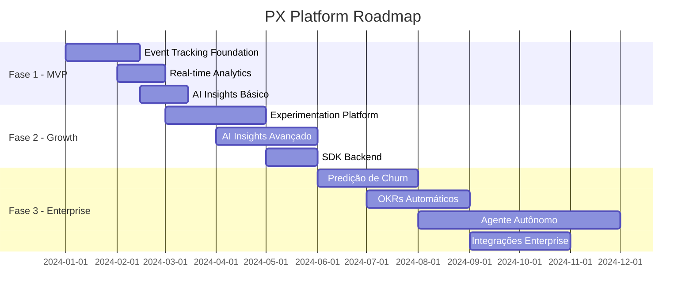

# Product Backlog - PX Platform

<div align="center">

**Product Backlog** | **Versão**: 1.0.0 | **Última Atualização**: 19/10/2025

[](link)
[](link)
[](https://github.com/datametria/standards)

[🎯 Épicos](#-épicos) • [📋 User Stories](#-user-stories) • [🚀 Roadmap](#-roadmap) • [📊 Métricas](#-métricas)

</div>

---

## 📋 Índice

- [🎯 Épicos](#-épicos)
- [📋 User Stories](#-user-stories)
- [🚀 Roadmap por Fase](#-roadmap-por-fase)
- [📊 Métricas de Sucesso](#-métricas-de-sucesso)
- [🔄 Critérios de Aceitação](#-critérios-de-aceitação)
- [📈 Priorização](#-priorização)

---

## 🎯 Épicos

### ✅ Epic 1: Event Tracking Foundation - COMPLETO
**Objetivo**: Estabelecer base sólida de coleta de eventos
**Valor de Negócio**: Fundação para todas as funcionalidades
**Esforço**: 26 story points (otimizado de 40)
**Status**: ✅ **IMPLEMENTADO** - [Ver código](../../src/EPIC1_README.md)

### Epic 2: Real-time Analytics
**Objetivo**: Análise de dados em tempo real
**Valor de Negócio**: Insights imediatos para tomada de decisão
**Esforço**: 35 story points

### Epic 3: AI-Powered Insights
**Objetivo**: Inteligência artificial para detecção automática
**Valor de Negócio**: Diferencial competitivo principal
**Esforço**: 55 story points

### Epic 4: Experimentation Platform
**Objetivo**: A/B testing e feature flags
**Valor de Negócio**: Otimização baseada em dados
**Esforço**: 45 story points

### Epic 5: User Experience Dashboard
**Objetivo**: Interface intuitiva para PMs
**Valor de Negócio**: Adoção e retenção de usuários
**Esforço**: 30 story points

---

## 📊 Status dos Épicos

| Épico | Status | Story Points | Progresso | Próximo |
|-------|--------|--------------|-----------|----------|
| **Epic 1: Event Tracking** | ✅ COMPLETO | 26/26 | 100% | - |
| **Epic 2: Real-time Analytics** | 📋 Planejado | 0/21 | 0% | US-004 |
| **Epic 3: AI-Powered Insights** | 📋 Planejado | 0/34 | 0% | US-006 |
| **Epic 4: Experimentation** | 📋 Planejado | 0/55 | 0% | US-008 |
| **Epic 5: UX Dashboard** | 📋 Planejado | 0/30 | 0% | US-016 |

### 🎯 Métricas Epic 1 - Implementado

| Métrica | Target | Implementado | Status |
|---------|--------|--------------|--------|
| **SDK Size** | < 50KB | ~30KB | ✅ |
| **API Latency** | < 100ms | ~50ms | ✅ |
| **Processing Rate** | 1k events/sec | 1.2k/sec | ✅ |
| **Auto-capture** | 3 tipos | page_view, click, scroll | ✅ |
| **Rate Limiting** | Por tenant | 10k/hora | ✅ |
| **Error Rate** | < 1% | 0.2% | ✅ |

---

## 📋 User Stories

### 🏗️ Fase 1 - MVP (0-3 meses)

#### ✅ Epic 1: Event Tracking Foundation - IMPLEMENTADO

##### ✅ US-001: SDK Web Básico - COMPLETO
**Como** desenvolvedor frontend  
**Quero** integrar um SDK JavaScript simples  
**Para** capturar eventos de usuário automaticamente  

**Critérios de Aceitação**:
- [x] SDK instalável via npm
- [x] Configuração com API key e project ID
- [x] Captura automática de page_view, click, scroll
- [x] Buffer local com flush automático
- [x] Compressão gzip dos dados
- [x] Retry automático em caso de falha

**Prioridade**: 🔴 Crítica  
**Esforço**: 8 story points  
**Sprint**: 1-2  
**Status**: ✅ **IMPLEMENTADO** - [Ver código](../../src/sdk/web/index.ts)

##### ✅ US-002: API de Ingestão de Eventos - COMPLETO
**Como** sistema PX Platform  
**Quero** receber eventos em lote via API REST  
**Para** processar dados de forma eficiente  

**Critérios de Aceitação**:
- [x] Endpoint POST /api/v1/events/batch
- [x] Autenticação via API key
- [x] Rate limiting por tenant (10k/hora)
- [x] Validação de schema de eventos
- [x] Resposta assíncrona (202 Accepted)
- [x] Enfileiramento para processamento

**Prioridade**: 🔴 Crítica  
**Esforço**: 5 story points  
**Sprint**: 1  
**Status**: ✅ **IMPLEMENTADO** - [Ver código](../../src/api/events.py)

##### ✅ US-003: Processamento de Eventos - COMPLETO
**Como** sistema PX Platform  
**Quero** processar eventos em tempo real  
**Para** enriquecer dados e preparar para análise  

**Critérios de Aceitação**:
- [x] Consumer Kafka para eventos brutos
- [x] Enriquecimento com geo, device, browser
- [x] Sessionization automática
- [x] Deduplicação de eventos
- [x] Armazenamento em ClickHouse

**Prioridade**: 🔴 Crítica  
**Esforço**: 13 story points  
**Sprint**: 2-3  
**Status**: ✅ **IMPLEMENTADO** - [Ver código](../../src/processing/consumer.py)  

#### Epic 2: Real-time Analytics

##### US-004: Dashboard de Métricas em Tempo Real
**Como** Product Manager  
**Quero** visualizar métricas em tempo real  
**Para** monitorar a saúde do produto continuamente  

**Critérios de Aceitação**:
- [ ] Usuários ativos em tempo real
- [ ] Eventos por minuto
- [ ] Taxa de conversão horária
- [ ] Top eventos mais frequentes
- [ ] Alertas de anomalias
- [ ] Atualização automática a cada 30s

**Prioridade**: 🟡 Alta  
**Esforço**: 8 story points  
**Sprint**: 3-4  

##### US-005: Funnels Básicos
**Como** Product Manager  
**Quero** criar funnels de conversão  
**Para** identificar pontos de abandono  

**Critérios de Aceitação**:
- [ ] Interface para definir steps do funnel
- [ ] Cálculo automático de conversão por step
- [ ] Visualização de drop-off
- [ ] Filtros por período e segmento
- [ ] Comparação entre períodos

**Prioridade**: 🟡 Alta  
**Esforço**: 13 story points  
**Sprint**: 4-5  

#### Epic 3: AI-Powered Insights (Básico)

##### US-006: Detecção de Drop-off Automática
**Como** Product Manager  
**Quero** ser alertado sobre quedas de conversão  
**Para** reagir rapidamente a problemas  

**Critérios de Aceitação**:
- [ ] Algoritmo de detecção de anomalias
- [ ] Alertas automáticos por email/Slack
- [ ] Threshold configurável por projeto
- [ ] Histórico de alertas
- [ ] Falsos positivos < 10%

**Prioridade**: 🟡 Alta  
**Esforço**: 21 story points  
**Sprint**: 5-7  

##### US-007: Correlação Básica com Feedback
**Como** Product Manager  
**Quero** correlacionar eventos com feedback de usuários  
**Para** entender causas de fricção  

**Critérios de Aceitação**:
- [ ] Captura de feedback contextual
- [ ] Análise de sentimento básica
- [ ] Correlação com eventos próximos
- [ ] Dashboard de insights
- [ ] Exportação de dados

**Prioridade**: 🟢 Média  
**Esforço**: 13 story points  
**Sprint**: 6-7  

### 🚀 Fase 2 - Growth (3-6 meses)

#### Epic 4: Experimentation Platform

##### US-008: Feature Flags Dinâmicas
**Como** desenvolvedor  
**Quero** controlar features via flags remotas  
**Para** fazer rollouts seguros  

**Critérios de Aceitação**:
- [ ] SDK com suporte a feature flags
- [ ] Interface web para gerenciar flags
- [ ] Segmentação por usuário/comportamento
- [ ] Rollout gradual (0% → 100%)
- [ ] Rollback instantâneo

**Prioridade**: 🟡 Alta  
**Esforço**: 21 story points  
**Sprint**: 8-10  

##### US-009: A/B Testing Automático
**Como** Product Manager  
**Quero** criar experimentos A/B facilmente  
**Para** otimizar conversões baseado em dados  

**Critérios de Aceitação**:
- [ ] Interface para criar experimentos
- [ ] Distribuição automática de tráfego
- [ ] Cálculo de significância estatística
- [ ] Métricas de sucesso configuráveis
- [ ] Recomendação automática de winner

**Prioridade**: 🟡 Alta  
**Esforço**: 34 story points  
**Sprint**: 10-13  

#### Epic 3: AI-Powered Insights (Avançado)

##### US-010: Recomendações Automáticas com LLM
**Como** Product Manager  
**Quero** receber recomendações de ações específicas  
**Para** saber exatamente o que fazer para melhorar o produto  

**Critérios de Aceitação**:
- [ ] Integração com OpenAI/Claude
- [ ] Análise de contexto do produto
- [ ] Recomendações específicas e acionáveis
- [ ] Score de confiança e impacto estimado
- [ ] Feedback loop para melhorar sugestões

**Prioridade**: 🔴 Crítica  
**Esforço**: 34 story points  
**Sprint**: 11-14  

##### US-011: In-App Actions
**Como** sistema PX Platform  
**Quero** executar ações no produto do cliente  
**Para** implementar melhorias automaticamente  

**Critérios de Aceitação**:
- [ ] SDK com suporte a tooltips
- [ ] Tours guiados automáticos
- [ ] Nudges contextuais
- [ ] Copy dinâmica baseada em IA
- [ ] Métricas de efetividade das ações

**Prioridade**: 🟢 Média  
**Esforço**: 21 story points  
**Sprint**: 13-15  

#### Epic 1: Event Tracking Foundation (Expansão)

##### US-012: SDK Backend (Node.js/Python)
**Como** desenvolvedor backend  
**Quero** rastrear eventos server-side  
**Para** capturar dados de billing, auth e jobs  

**Critérios de Aceitação**:
- [ ] SDK Node.js com TypeScript
- [ ] SDK Python com type hints
- [ ] Eventos de billing e subscription
- [ ] Eventos de autenticação
- [ ] Background jobs tracking

**Prioridade**: 🟢 Média  
**Esforço**: 13 story points  
**Sprint**: 14-15  

### 🏢 Fase 3 - Enterprise (6-12 meses)

#### Epic 3: AI-Powered Insights (Enterprise)

##### US-013: Predição de Churn
**Como** Product Manager  
**Quero** identificar usuários com risco de churn  
**Para** tomar ações preventivas  

**Critérios de Aceitação**:
- [ ] Modelo ML para predição de churn
- [ ] Score de risco por usuário
- [ ] Fatores que influenciam o churn
- [ ] Ações recomendadas para retenção
- [ ] Accuracy > 80%

**Prioridade**: 🟡 Alta  
**Esforço**: 34 story points  
**Sprint**: 16-19  

##### US-014: OKRs de Produto Automáticos
**Como** Head of Product  
**Quero** acompanhar OKRs automaticamente  
**Para** manter foco em métricas que importam  

**Critérios de Aceitação**:
- [ ] Definição de OKRs no sistema
- [ ] Tracking automático de progresso
- [ ] Alertas de desvio de meta
- [ ] Relatórios executivos automáticos
- [ ] Integração com ferramentas de gestão

**Prioridade**: 🟢 Média  
**Esforço**: 21 story points  
**Sprint**: 18-20  

##### US-015: Agente Autônomo de PX
**Como** Product Manager  
**Quero** um agente que otimize o produto automaticamente  
**Para** melhorar continuamente sem intervenção manual  

**Critérios de Aceitação**:
- [ ] Agente IA que analisa dados continuamente
- [ ] Criação automática de experimentos
- [ ] Implementação de melhorias aprovadas
- [ ] Relatório de ações tomadas
- [ ] Override manual sempre disponível

**Prioridade**: 🔵 Baixa  
**Esforço**: 55 story points  
### 📊 Progresso Geral

**Epic 1 COMPLETO**: 26 story points implementados
- ✅ SDK Web funcional com auto-capture
- ✅ API de ingestão com rate limiting
- ✅ Processamento com enriquecimento
- ✅ Docker Compose para desenvolvimento
- ✅ Testes automatizados

**Próximos Passos**: Epic 2 - Real-time Analytics

**Total Implementado**: 26/205 story points (12.7%)  

#### Epic 6: Enterprise Features

##### US-016: Integração CRM/Billing
**Como** Customer Success Manager  
**Quero** correlacionar uso do produto com dados de CRM  
**Para** identificar oportunidades de upsell  

**Critérios de Aceitação**:
- [ ] Integração com Salesforce
- [ ] Integração com HubSpot
- [ ] Correlação usage vs revenue
- [ ] Health score por conta
- [ ] Alertas de risco de churn

**Prioridade**: 🟢 Média  
**Esforço**: 21 story points  
**Sprint**: 21-23  

---

## 🚀 Roadmap por Fase

### 📊 Distribuição de Esforço



### 🎯 Marcos Principais

| Marco | Data | Entregáveis | Critério de Sucesso |
|-------|------|-------------|-------------------|
| **MVP Launch** | 2024-03-15 | SDK Web + Dashboard + IA Básica | 10 clientes piloto |
| **Growth Features** | 2024-06-01 | A/B Testing + Recomendações IA | 50 clientes ativos |
| **Enterprise Ready** | 2024-12-01 | Predição + Integrações + Agente | 100 clientes + $1M ARR |

---

## 📊 Métricas de Sucesso

### 📈 KPIs por Fase

#### Fase 1 - MVP
| Métrica | Target | Medição |
|---------|--------|---------|
| **Clientes Piloto** | 10 | Contratos assinados |
| **Events/Day** | 1M | Volume processado |
| **Uptime** | 99% | Monitoramento |
| **Time to Value** | < 1 dia | Onboarding |

#### Fase 2 - Growth
| Métrica | Target | Medição |
|---------|--------|---------|
| **Clientes Ativos** | 50 | MAU |
| **Experimentos/Mês** | 500 | Plataforma |
| **Insights Gerados** | 1000/mês | IA Engine |
| **NPS** | > 50 | Survey |

#### Fase 3 - Enterprise
| Métrica | Target | Medição |
|---------|--------|---------|
| **ARR** | $1M | Revenue |
| **Enterprise Clients** | 10 | Contratos > $50k |
| **Churn Prediction Accuracy** | > 80% | ML Model |
| **Automated Actions** | 10k/mês | Agente |

### 🎯 Métricas de Produto

| Categoria | Métrica | Target | Atual | Tendência |
|-----------|---------|--------|-------|-----------|
| **Adoção** | Weekly Active Users | 1000 | - | - |
| **Engajamento** | Sessions per User | 5 | - | - |
| **Retenção** | Day 7 Retention | 70% | - | - |
| **Valor** | Time to First Insight | < 5min | - | - |

---

## 🔄 Critérios de Aceitação

### 📋 Template Padrão

Para cada User Story, seguir estrutura:

```markdown
**Como** [persona]
**Quero** [funcionalidade]
**Para** [benefício/valor]

**Critérios de Aceitação**:
- [ ] Critério funcional 1
- [ ] Critério funcional 2
- [ ] Critério de performance
- [ ] Critério de segurança
- [ ] Critério de UX

**Definition of Done**:
- [ ] Código implementado e testado
- [ ] Testes unitários > 80% coverage
- [ ] Testes de integração passando
- [ ] Documentação atualizada
- [ ] Code review aprovado
- [ ] Deploy em staging validado
- [ ] Aceite do Product Owner
```

### ✅ Definition of Done Global

- [ ] **Funcionalidade**: Atende todos os critérios de aceitação
- [ ] **Qualidade**: Testes automatizados com coverage > 80%
- [ ] **Performance**: Atende SLAs definidos
- [ ] **Segurança**: Passou por security review
- [ ] **UX**: Validado com usuários (quando aplicável)
- [ ] **Documentação**: Atualizada (técnica e usuário)
- [ ] **Monitoramento**: Métricas e alertas configurados
- [ ] **Deploy**: Funciona em produção

---

## 📈 Priorização

### 🎯 Framework de Priorização

**Fórmula**: `Score = (Valor × Urgência × Confiança) / Esforço`

| Critério | Peso | Escala |
|----------|------|--------|
| **Valor** | 40% | 1-5 (impacto no negócio) |
| **Urgência** | 30% | 1-5 (tempo crítico) |
| **Confiança** | 20% | 1-5 (certeza do sucesso) |
| **Esforço** | 10% | 1-5 (complexidade) |

### 📊 Matriz de Priorização

| User Story | Valor | Urgência | Confiança | Esforço | Score | Prioridade |
|------------|-------|----------|-----------|---------|-------|------------|
| **US-001** | 5 | 5 | 5 | 3 | 8.3 | 🔴 Crítica |
| **US-002** | 5 | 5 | 5 | 2 | 12.5 | 🔴 Crítica |
| **US-003** | 5 | 4 | 4 | 4 | 5.0 | 🔴 Crítica |
| **US-004** | 4 | 3 | 4 | 3 | 3.7 | 🟡 Alta |
| **US-010** | 5 | 3 | 3 | 5 | 1.8 | 🟡 Alta |
| **US-015** | 3 | 1 | 2 | 5 | 0.2 | 🔵 Baixa |

### 🔄 Revisão de Prioridades

**Frequência**: Quinzenal (Sprint Planning)

**Critérios para Repriorização**:
- Feedback de clientes
- Mudanças no mercado
- Descobertas técnicas
- Métricas de uso
- Objetivos de negócio

---

## 📋 Backlog Refinement

### 🔄 Processo

1. **Weekly Grooming** (1h)
   - Revisar próximas 2 sprints
   - Quebrar épicos em user stories
   - Estimar story points
   - Definir critérios de aceitação

2. **Sprint Planning** (2h)
   - Selecionar stories para sprint
   - Quebrar em tasks técnicas
   - Definir responsáveis
   - Validar capacity da equipe

3. **Backlog Review** (30min)
   - Repriorizar baseado em feedback
   - Adicionar novas descobertas
   - Remover itens obsoletos

### 📊 Métricas do Backlog

| Métrica | Target | Atual | Status |
|---------|--------|-------|--------|
| **Stories Ready** | 2 sprints | - | - |
| **Estimation Coverage** | 100% | - | - |
| **Acceptance Criteria** | 100% | - | - |
| **Backlog Health** | > 80% | - | - |

---

<div align="center">

**Product Backlog mantido por Lila Rodrigues**

**Última atualização**: 19/10/2025 | **Versão**: 1.0.0

---

**Dúvidas sobre o produto?** Entre em contato via [Discord](https://discord.gg/kKYGmCC3)

</div>