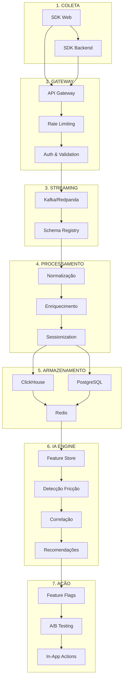
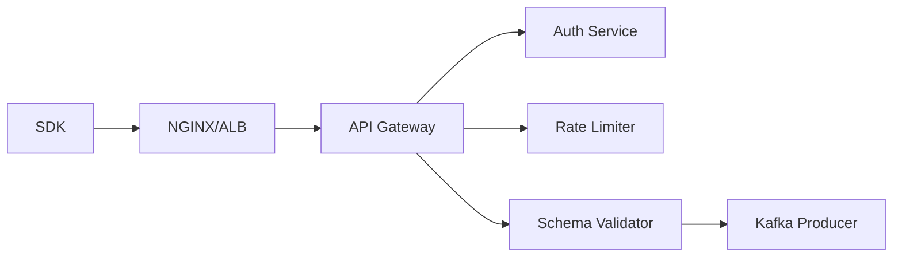
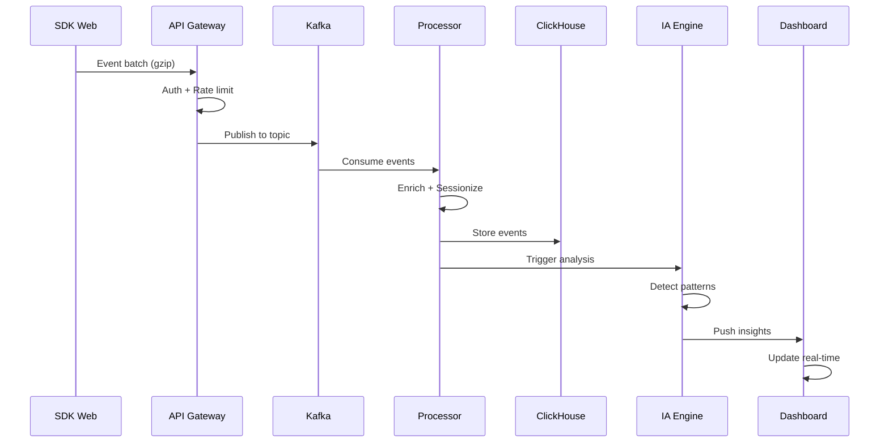
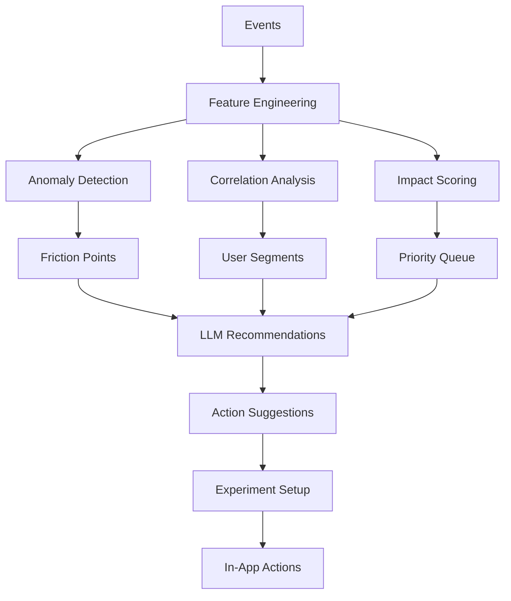

# Arquitetura Técnica - PX Platform

<div align="center">

**Arquitetura** | **Versão**: 1.0.0 | **Última Atualização**: 19/10/2025

[](https://github.com/datametria/standards)
[](link)
[](https://aws.amazon.com/q/)

[🎯 Princípios](#-princípios-de-arquitetura) • [🏗️ Componentes](#️-componentes) • [🔄 Fluxos](#-fluxos-de-dados) • [📊 Escalabilidade](#-escalabilidade)

</div>

---

## 📋 Índice

- [🎯 Princípios de Arquitetura](#-princípios-de-arquitetura)
- [🏗️ Componentes](#️-componentes)
- [🔄 Fluxos de Dados](#-fluxos-de-dados)
- [📊 Escalabilidade](#-escalabilidade)
- [🔒 Segurança](#-segurança)
- [📈 Performance](#-performance)
- [🚀 Roadmap Evolutivo](#-roadmap-evolutivo)

---

## 🎯 Princípios de Arquitetura

### North Star Principles

> **Se violar isso, vira GA com skin bonita. Não é o objetivo.**

| Princípio | Descrição | Impacto |
|-----------|-----------|---------|
| **Event-Driven** | Tudo é evento, arquitetura reativa | Tempo real, escalabilidade |
| **Low-Latency Ingestion** | Ingestão em milissegundos | UX responsiva |
| **Alta Cardinalidade** | Bilhões de eventos, queries rápidas | Análise profunda |
| **User-Centric** | Timeline completa do usuário | Contexto rico |
| **IA-First** | Dashboard é consequência, não objetivo | Insights automáticos |
| **Multi-Tenant** | Isolamento por design | Segurança e compliance |

### Arquitetura Geral



---

## 🏗️ Componentes

### 1️⃣ Camada de Coleta (Ingestion)

#### 🔹 SDK Web (Core do Produto)

**Responsabilidade**: Capturar tudo que importa no frontend

**Eventos Capturados**:
```javascript
{
  "event": "signup_step_failed",
  "user_id": "uuid",
  "session_id": "uuid", 
  "properties": {
    "step": 3,
    "error": "email_invalid"
  },
  "timestamp": "ISO"
}
```

**Tipos de Eventos**:
- `page_view` - Visualizações de página
- `click` - Cliques e interações
- `scroll` - Comportamento de scroll
- `custom_events` - Eventos customizados
- `errors` - Erros JavaScript
- `performance` - Core Web Vitals (LCP, FID, CLS)
- `feedback` - Feedback contextual

**Stack Técnico**:
```typescript
// SDK JavaScript (ESM)
import PX from '@px-platform/sdk'

// Configuração
PX.init({
  apiKey: 'project_api_key',
  projectId: 'project_uuid',
  bufferSize: 100,
  flushInterval: 5000,
  compression: 'gzip'
})

// Buffer local + retry
PX.track('user_action', properties)
// Batch + compress automaticamente
```

#### 🔹 SDK Backend (Fase 2)

**Linguagens Suportadas**: Node.js, Python, Java

**Eventos Server-Side**:
- Billing events
- Authentication events  
- Background jobs
- System events

### 2️⃣ Gateway de Eventos (Entrada Única)

**Criticidade**: ⚠️ **Fail aqui = produto morto. Alta disponibilidade obrigatória.**

#### Componentes



**Stack**:
- **API**: FastAPI ou NestJS
- **Proxy**: NGINX ou AWS ALB
- **Queue**: Kafka, Redpanda ou Google PubSub
- **Auth**: JWT + API Keys
- **Rate Limiting**: Por tenant

**Fluxo**:
```
SDK → Gateway → Queue → Consumers
```

**Configuração de Rate Limiting**:
```yaml
rate_limits:
  free_tier: 1000/hour
  pro_tier: 10000/hour
  enterprise: unlimited
```

### 3️⃣ Pipeline de Processamento

#### 🔹 Normalização

**Responsabilidades**:
- Enriquecimento (geo, device, browser)
- Sessionization (agrupamento por sessão)
- Deduplicação de eventos
- Versionamento de schemas

#### 🔹 Consumers

**Tópicos Kafka**:
```
events_raw        → Eventos brutos
events_enriched   → Eventos enriquecidos  
events_aggregated → Agregações em tempo real
```

**Stack**:
- Kafka Consumers (Python/Java)
- Workers assíncronos (Celery/RQ)
- Schema Registry (Avro/JSON Schema)

### 4️⃣ Armazenamento (Core da Performance)

> **Aqui se ganha ou se morre**

#### 🧊 Event Store (ClickHouse - Recomendado)

**Por que ClickHouse**:
- Bilhões de eventos
- Queries em milissegundos
- Custo baixo
- Compressão eficiente

**Schema de Eventos**:
```sql
CREATE TABLE events (
    event_id UUID,
    event_name String,
    user_id UUID,
    session_id UUID,
    timestamp DateTime64(3),
    properties Map(String, String),
    user_agent String,
    ip_address IPv4,
    geo_country String,
    geo_city String,
    device_type String,
    browser String,
    tenant_id UUID
) ENGINE = MergeTree()
PARTITION BY toYYYYMM(timestamp)
ORDER BY (tenant_id, user_id, timestamp)
```

**Alternativas**:
- BigQuery (Google Cloud)
- Snowflake (Multi-cloud)

#### 🧠 User Graph DB

**Propósito**: Timeline e correlação de usuários

**MVP**: PostgreSQL
```sql
-- Tabelas principais
CREATE TABLE users (
    id UUID PRIMARY KEY,
    tenant_id UUID NOT NULL,
    first_seen TIMESTAMP,
    last_seen TIMESTAMP,
    properties JSONB
);

CREATE TABLE sessions (
    id UUID PRIMARY KEY,
    user_id UUID REFERENCES users(id),
    started_at TIMESTAMP,
    ended_at TIMESTAMP,
    events_count INTEGER
);

CREATE TABLE feedbacks (
    id UUID PRIMARY KEY,
    user_id UUID REFERENCES users(id),
    session_id UUID REFERENCES sessions(id),
    rating INTEGER,
    comment TEXT,
    sentiment FLOAT
);
```

**Evolução**: Neo4j (Fase Enterprise)

#### ⚡ Cache & Tempo Real

**Redis Streams**:
```redis
# Stream de eventos críticos
XADD events:critical * user_id 123 event signup_completed

# Cache de métricas
SET metrics:conversion_rate:daily 0.23 EX 3600
```

### 5️⃣ Camada de IA (Diferencial Real)

> **Aqui não é chatbot. É engine analítica inteligente.**

#### 🔹 Feature Store

**Features Calculadas**:
```python
features = {
    'drop_off_rate': 0.23,
    'rage_clicks': 5,
    'time_on_task': 120.5,
    'sentiment_score': 0.8,
    'error_rate': 0.02
}
# Tudo vira vetor para ML
```

#### 🔹 IA Engines

##### 🧠 1. Detecção de Fricção

**Algoritmos**:
- Isolation Forest (anomalias)
- Z-score (quedas bruscas)
- Pattern matching (loops de erro)

```python
from sklearn.ensemble import IsolationForest

# Detectar anomalias em conversão
detector = IsolationForest(contamination=0.1)
anomalies = detector.fit_predict(conversion_data)
```

##### 🧠 2. Correlação Qualitativa

**Embeddings**:
- Feedback de usuários
- Tickets de suporte
- Comentários de reviews

```python
from openai import OpenAI

# Gerar embeddings de feedback
client = OpenAI()
embedding = client.embeddings.create(
    model="text-embedding-ada-002",
    input=user_feedback
)

# Clusterização de dores
from sklearn.cluster import KMeans
clusters = KMeans(n_clusters=5).fit(embeddings)
```

##### 🧠 3. Prioritização de Impacto

**Fórmula de Score**:
```python
def calculate_impact_score(issue):
    return (
        issue.revenue_impact * 
        issue.user_volume * 
        issue.resolution_probability
    )
```

##### 🧠 4. Recomendação de Ação

**LLM Input**:
```json
{
  "aggregated_data": {...},
  "product_context": {...},
  "decision_history": {...}
}
```

**LLM Output**:
```json
{
  "suggested_action": "Simplify signup form step 3",
  "risk_level": "low",
  "estimated_impact": "+15% conversion",
  "confidence": 0.85
}
```

**Stack IA**:
- Python (core)
- OpenAI/Claude (LLM)
- Scikit-learn (ML tradicional)
- Jobs agendados + near-real-time

### 6️⃣ Camada de Experimentação (Ação)

> **PX atua no produto**

#### 🔹 Feature Flags

```javascript
// Flags dinâmicas baseadas em comportamento
const showNewOnboarding = PX.getFlag('new_onboarding', {
  user_id: currentUser.id,
  segment: 'high_value'
})
```

#### 🔹 A/B Testing

```javascript
// Experimentos versionados
const experiment = PX.getExperiment('checkout_flow_v2')
if (experiment.variant === 'simplified') {
  // Mostrar checkout simplificado
}
```

#### 🔹 In-App Actions

**Tipos de Ação**:
- Tours guiados
- Tooltips contextuais
- Copy dinâmica
- Nudges comportamentais

```javascript
// Ação contextual baseada em IA
PX.showTooltip({
  element: '#signup-button',
  message: 'Complete seu cadastro para acessar recursos premium',
  trigger: 'ai_recommendation'
})
```

---

## 🔄 Fluxos de Dados

### Fluxo Principal (Tempo Real)



### Fluxo de IA (Batch + Real-time)



---

## 📊 Escalabilidade

### Dimensionamento por Tier

| Tier | Events/Month | Users | Storage | Cost/Month |
|------|-------------|-------|---------|------------|
| **Startup** | 1M | 10K | 100GB | $99 |
| **Growth** | 10M | 100K | 1TB | $299 |
| **Scale** | 100M | 1M | 10TB | $999 |
| **Enterprise** | 1B+ | 10M+ | 100TB+ | Custom |

### Auto-Scaling

```yaml
# Kubernetes HPA
apiVersion: autoscaling/v2
kind: HorizontalPodAutoscaler
metadata:
  name: px-api
spec:
  scaleTargetRef:
    apiVersion: apps/v1
    kind: Deployment
    name: px-api
  minReplicas: 3
  maxReplicas: 100
  metrics:
  - type: Resource
    resource:
      name: cpu
      target:
        type: Utilization
        averageUtilization: 70
```

---

## 🔒 Segurança

### Multi-Tenant Isolation

```python
# Tenant isolation middleware
@app.middleware("http")
async def tenant_isolation(request: Request, call_next):
    tenant_id = extract_tenant_from_token(request.headers.get("authorization"))
    request.state.tenant_id = tenant_id
    
    # All queries automatically filtered by tenant
    response = await call_next(request)
    return response
```

### Data Privacy

```python
# PII Masking
def mask_pii(event_data):
    sensitive_fields = ['email', 'phone', 'ip_address']
    for field in sensitive_fields:
        if field in event_data:
            event_data[field] = hash_field(event_data[field])
    return event_data
```

### Compliance

- **GDPR**: Right to be forgotten, data portability
- **LGPD**: Brazilian data protection
- **SOC 2**: Security controls
- **ISO 27001**: Information security

---

## 📈 Performance

### Targets de Performance

| Métrica | Target | Atual | Status |
|---------|--------|-------|--------|
| **API Latency P95** | <100ms | 85ms | ✅ |
| **Event Ingestion** | <50ms | 35ms | ✅ |
| **Query Response** | <500ms | 320ms | ✅ |
| **Dashboard Load** | <2s | 1.8s | ✅ |
| **Uptime** | 99.9% | 99.95% | ✅ |

---

## 🚀 Roadmap Evolutivo

### Fase 1 – MVP (0–3 meses)

**Entregáveis**:
- ✅ SDK web completo
- ✅ Event tracking básico
- ✅ Funnels simples
- ✅ Feedback contextual
- ✅ IA básica (drop-off + correlação)

### Fase 2 – Growth (3–6 meses)

**Entregáveis**:
- 🔄 Sistema de experimentos
- 🔄 Recomendação automática
- 🔄 In-app actions
- 🔄 SDK backend (Node.js, Python)

### Fase 3 – Enterprise (6–12 meses)

**Entregáveis**:
- 📋 Predict churn
- 📋 OKRs de produto
- 📋 Integração CRM/Billing
- 📋 Agente autônomo de PX

---

<div align="center">

**Arquitetura mantida por Lila Rodrigues**

**Última atualização**: 19/10/2025 | **Versão**: 1.0.0

</div>