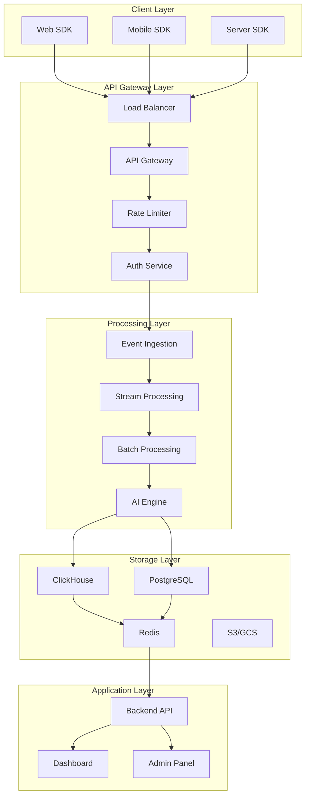

# Especificação Técnica - PX Platform

<div align="center">

**Especificação Técnica** | **Versão**: 1.0.0 | **Última Atualização**: 19/10/2025

[](link)
[](link)
[](https://github.com/datametria/standards)

[🎯 Visão Geral](#-visão-geral) • [🏗️ Arquitetura](#️-arquitetura) • [📊 Dados](#-modelo-de-dados) • [🔧 Implementação](#-implementação)

</div>

---

## 📋 Índice

- [🎯 Visão Geral](#-visão-geral)
- [🏗️ Arquitetura do Sistema](#️-arquitetura-do-sistema)
- [📊 Modelo de Dados](#-modelo-de-dados)
- [🔧 Implementação](#-implementação)
- [📈 Performance](#-performance)
- [🔒 Segurança](#-segurança)
- [🚀 Deployment](#-deployment)
- [📋 Requisitos](#-requisitos)

---

## 🎯 Visão Geral

### Definição do Produto

**PX Platform** é um sistema de Product Experience Intelligence que combina:

- **Coleta de eventos** em tempo real
- **Análise por IA** para detecção de fricções
- **Ações automatizadas** para otimização
- **Experimentação** baseada em dados

### Objetivos Técnicos

| Objetivo | Métrica | Target | Justificativa |
|----------|---------|--------|---------------|
| **Low Latency** | Event ingestion | <50ms | UX responsiva |
| **High Throughput** | Events/second | 100k+ | Escalabilidade |
| **Availability** | Uptime | 99.9% | Confiabilidade |
| **Accuracy** | IA predictions | 85%+ | Insights úteis |

### Princípios de Design

1. **Event-Driven**: Arquitetura reativa baseada em eventos
2. **IA-First**: Inteligência artificial como core, não feature
3. **Multi-Tenant**: Isolamento completo por cliente
4. **Real-Time**: Processamento e insights em tempo real
5. **Scalable**: Horizontal scaling automático

---

## 🏗️ Arquitetura do Sistema

### Visão de Alto Nível



### Componentes Principais

#### 1. SDK Layer

**Web SDK (JavaScript/TypeScript)**
```typescript
interface PXConfig {
  apiKey: string
  projectId: string
  endpoint?: string
  bufferSize?: number
  flushInterval?: number
  compression?: boolean
  debug?: boolean
}

interface PXEvent {
  event: string
  userId?: string
  sessionId?: string
  timestamp?: string
  properties?: Record<string, any>
}

class PXClient {
  constructor(config: PXConfig)
  init(): Promise<void>
  track(event: string, properties?: Record<string, any>): void
  identify(userId: string, traits?: Record<string, any>): void
  flush(): Promise<void>
}
```

**Mobile SDK (React Native/Flutter)**
```dart
// Flutter SDK
class PXFlutter {
  static Future<void> initialize(String apiKey, String projectId) async {}
  static Future<void> track(String event, Map<String, dynamic> properties) async {}
  static Future<void> identify(String userId, Map<String, dynamic> traits) async {}
}
```

#### 2. API Gateway

**Tecnologias**:
- **Load Balancer**: AWS ALB / GCP Load Balancer
- **API Gateway**: Kong / AWS API Gateway
- **Rate Limiting**: Redis-based sliding window
- **Authentication**: JWT + API Keys

**Configuração**:
```yaml
# Kong configuration
services:
  - name: px-api
    url: http://backend:8000
    
routes:
  - name: events
    service: px-api
    paths: ["/api/v1/events"]
    
plugins:
  - name: rate-limiting
    config:
      minute: 1000
      hour: 10000
  - name: jwt
    config:
      secret_is_base64: false
```

#### 3. Event Processing

**Stream Processing (Kafka + Python)**
```python
from kafka import KafkaConsumer, KafkaProducer
import json
import asyncio

class EventProcessor:
    def __init__(self):
        self.consumer = KafkaConsumer(
            'events-raw',
            bootstrap_servers=['kafka:9092'],
            value_deserializer=lambda x: json.loads(x.decode('utf-8'))
        )
        self.producer = KafkaProducer(
            bootstrap_servers=['kafka:9092'],
            value_serializer=lambda x: json.dumps(x).encode('utf-8')
        )
    
    async def process_events(self):
        for message in self.consumer:
            event = message.value
            
            # Enrich event
            enriched_event = await self.enrich_event(event)
            
            # Sessionize
            session_event = await self.sessionize(enriched_event)
            
            # Send to storage
            self.producer.send('events-enriched', session_event)
    
    async def enrich_event(self, event):
        # Add geo, device, browser info
        return {
            **event,
            'geo_country': await self.get_country(event.get('ip')),
            'device_type': self.parse_device(event.get('user_agent')),
            'browser': self.parse_browser(event.get('user_agent'))
        }
```

#### 4. AI Engine

**Friction Detection**
```python
from sklearn.ensemble import IsolationForest
import numpy as np

class FrictionDetector:
    def __init__(self):
        self.model = IsolationForest(contamination=0.1)
    
    def detect_anomalies(self, funnel_data):
        """Detect drop-off anomalies in conversion funnels"""
        features = self.extract_features(funnel_data)
        anomalies = self.model.fit_predict(features)
        return self.format_results(anomalies, funnel_data)
    
    def extract_features(self, data):
        return np.array([
            [d['conversion_rate'], d['time_on_step'], d['error_rate']]
            for d in data
        ])
```

**LLM Integration**
```python
from openai import OpenAI

class InsightGenerator:
    def __init__(self):
        self.client = OpenAI()
    
    async def generate_recommendation(self, friction_data, context):
        prompt = f"""
        Analyze this product friction data and provide actionable recommendations:
        
        Friction Points: {friction_data}
        Product Context: {context}
        
        Provide:
        1. Root cause analysis
        2. Specific action to take
        3. Expected impact
        4. Implementation difficulty (1-5)
        """
        
        response = await self.client.chat.completions.create(
            model="gpt-4",
            messages=[{"role": "user", "content": prompt}]
        )
        
        return self.parse_recommendation(response.choices[0].message.content)
```

---

## 📊 Modelo de Dados

### Event Store Schema (ClickHouse)

```sql
-- Main events table
CREATE TABLE events (
    event_id UUID DEFAULT generateUUIDv4(),
    tenant_id UUID NOT NULL,
    project_id UUID NOT NULL,
    user_id UUID,
    session_id UUID,
    event_name String NOT NULL,
    timestamp DateTime64(3) DEFAULT now64(),
    
    -- Event properties
    properties Map(String, String),
    
    -- Enriched data
    ip_address IPv4,
    user_agent String,
    geo_country FixedString(2),
    geo_city String,
    device_type Enum8('desktop' = 1, 'mobile' = 2, 'tablet' = 3),
    browser String,
    os String,
    
    -- Processing metadata
    ingested_at DateTime64(3) DEFAULT now64(),
    processed_at DateTime64(3),
    version UInt8 DEFAULT 1
    
) ENGINE = MergeTree()
PARTITION BY (tenant_id, toYYYYMM(timestamp))
ORDER BY (tenant_id, user_id, timestamp)
SETTINGS index_granularity = 8192;

-- Materialized views for aggregations
CREATE MATERIALIZED VIEW events_hourly
ENGINE = SummingMergeTree()
PARTITION BY (tenant_id, toYYYYMMDD(timestamp))
ORDER BY (tenant_id, project_id, event_name, toStartOfHour(timestamp))
AS SELECT
    tenant_id,
    project_id,
    event_name,
    toStartOfHour(timestamp) as hour,
    count() as event_count,
    uniq(user_id) as unique_users,
    uniq(session_id) as unique_sessions
FROM events
GROUP BY tenant_id, project_id, event_name, hour;
```

### User Graph Schema (PostgreSQL)

```sql
-- Users table
CREATE TABLE users (
    id UUID PRIMARY KEY DEFAULT gen_random_uuid(),
    tenant_id UUID NOT NULL,
    project_id UUID NOT NULL,
    
    -- Identity
    external_id VARCHAR(255),
    email VARCHAR(255),
    
    -- Timestamps
    first_seen TIMESTAMPTZ NOT NULL,
    last_seen TIMESTAMPTZ NOT NULL,
    created_at TIMESTAMPTZ DEFAULT NOW(),
    updated_at TIMESTAMPTZ DEFAULT NOW(),
    
    -- Properties
    properties JSONB DEFAULT '{}',
    
    -- Computed fields
    total_events INTEGER DEFAULT 0,
    total_sessions INTEGER DEFAULT 0,
    lifetime_value DECIMAL(10,2) DEFAULT 0,
    
    -- Indexes
    CONSTRAINT users_tenant_external_unique UNIQUE (tenant_id, external_id)
);

CREATE INDEX idx_users_tenant_id ON users (tenant_id);
CREATE INDEX idx_users_last_seen ON users (last_seen);
CREATE INDEX idx_users_properties ON users USING GIN (properties);

-- Sessions table
CREATE TABLE sessions (
    id UUID PRIMARY KEY DEFAULT gen_random_uuid(),
    tenant_id UUID NOT NULL,
    user_id UUID REFERENCES users(id),
    
    -- Session data
    started_at TIMESTAMPTZ NOT NULL,
    ended_at TIMESTAMPTZ,
    duration_seconds INTEGER,
    
    -- Counts
    events_count INTEGER DEFAULT 0,
    page_views INTEGER DEFAULT 0,
    
    -- Properties
    initial_referrer VARCHAR(500),
    utm_source VARCHAR(100),
    utm_medium VARCHAR(100),
    utm_campaign VARCHAR(100),
    
    -- Device info
    device_type VARCHAR(20),
    browser VARCHAR(50),
    os VARCHAR(50),
    
    created_at TIMESTAMPTZ DEFAULT NOW()
);

CREATE INDEX idx_sessions_tenant_user ON sessions (tenant_id, user_id);
CREATE INDEX idx_sessions_started_at ON sessions (started_at);
```

### Insights Schema

```sql
-- AI-generated insights
CREATE TABLE insights (
    id UUID PRIMARY KEY DEFAULT gen_random_uuid(),
    tenant_id UUID NOT NULL,
    project_id UUID NOT NULL,
    
    -- Insight metadata
    type VARCHAR(50) NOT NULL, -- 'friction', 'opportunity', 'anomaly'
    priority VARCHAR(20) NOT NULL, -- 'low', 'medium', 'high', 'critical'
    status VARCHAR(20) DEFAULT 'active', -- 'active', 'dismissed', 'implemented'
    
    -- Content
    title VARCHAR(200) NOT NULL,
    description TEXT,
    recommendation TEXT,
    
    -- Metrics
    confidence_score DECIMAL(3,2), -- 0.00 to 1.00
    impact_score DECIMAL(3,2),
    affected_users INTEGER,
    revenue_impact DECIMAL(12,2),
    
    -- AI metadata
    model_version VARCHAR(20),
    generated_at TIMESTAMPTZ NOT NULL,
    
    -- Feedback
    user_rating INTEGER, -- 1-5
    implemented BOOLEAN DEFAULT FALSE,
    implementation_notes TEXT,
    
    created_at TIMESTAMPTZ DEFAULT NOW(),
    updated_at TIMESTAMPTZ DEFAULT NOW()
);
```

---

## 🔧 Implementação

### Backend Architecture (FastAPI)

```python
# main.py
from fastapi import FastAPI, Depends, HTTPException
from fastapi.middleware.cors import CORSMiddleware
from fastapi.middleware.gzip import GZipMiddleware
import uvicorn

app = FastAPI(
    title="PX Platform API",
    version="1.0.0",
    description="Product Experience Intelligence Platform"
)

# Middleware
app.add_middleware(GZipMiddleware, minimum_size=1000)
app.add_middleware(
    CORSMiddleware,
    allow_origins=["*"],
    allow_credentials=True,
    allow_methods=["*"],
    allow_headers=["*"],
)

# Routes
from routers import events, insights, users, experiments, analytics

app.include_router(events.router, prefix="/api/v1/events", tags=["events"])
app.include_router(insights.router, prefix="/api/v1/insights", tags=["insights"])
app.include_router(users.router, prefix="/api/v1/users", tags=["users"])
app.include_router(experiments.router, prefix="/api/v1/experiments", tags=["experiments"])
app.include_router(analytics.router, prefix="/api/v1/analytics", tags=["analytics"])

if __name__ == "__main__":
    uvicorn.run(app, host="0.0.0.0", port=8000)
```

**Event Ingestion Endpoint**
```python
# routers/events.py
from fastapi import APIRouter, Depends, BackgroundTasks
from pydantic import BaseModel
from typing import List, Dict, Any
import asyncio

router = APIRouter()

class Event(BaseModel):
    event: str
    user_id: str = None
    session_id: str = None
    timestamp: str = None
    properties: Dict[str, Any] = {}

class EventBatch(BaseModel):
    events: List[Event]

@router.post("/batch")
async def ingest_events(
    batch: EventBatch,
    background_tasks: BackgroundTasks,
    tenant_id: str = Depends(get_tenant_id)
):
    """Ingest batch of events for processing"""
    
    # Validate events
    validated_events = []
    for event in batch.events:
        validated_event = await validate_event(event, tenant_id)
        validated_events.append(validated_event)
    
    # Queue for processing
    background_tasks.add_task(process_events_async, validated_events)
    
    return {
        "success": True,
        "events_received": len(validated_events),
        "processing_id": generate_processing_id()
    }

async def process_events_async(events: List[Event]):
    """Process events asynchronously"""
    tasks = []
    for event in events:
        task = asyncio.create_task(process_single_event(event))
        tasks.append(task)
    
    await asyncio.gather(*tasks)
```

### Frontend Architecture (Vue.js 3)

```vue
<!-- Dashboard.vue -->
<template>
  <div class="dashboard">
    <DashboardHeader :project="currentProject" />
    
    <div class="dashboard-grid">
      <MetricsOverview :metrics="realTimeMetrics" />
      <FrictionDetector :frictions="detectedFrictions" />
      <InsightsList :insights="prioritizedInsights" />
      <ExperimentCenter :experiments="activeExperiments" />
    </div>
    
    <UserTimeline 
      v-if="selectedUser" 
      :user-id="selectedUser.id" 
      @close="selectedUser = null"
    />
  </div>
</template>

<script setup lang="ts">
import { ref, onMounted, onUnmounted } from 'vue'
import { useWebSocket } from '@/composables/useWebSocket'
import { useRealTimeMetrics } from '@/composables/useRealTimeMetrics'

// Composables
const { connect, disconnect, subscribe } = useWebSocket()
const { metrics: realTimeMetrics, startPolling, stopPolling } = useRealTimeMetrics()

// State
const currentProject = ref(null)
const detectedFrictions = ref([])
const prioritizedInsights = ref([])
const activeExperiments = ref([])
const selectedUser = ref(null)

onMounted(async () => {
  // Connect to real-time updates
  await connect()
  subscribe('insights', handleNewInsight)
  subscribe('frictions', handleNewFriction)
  
  // Start metrics polling
  startPolling()
  
  // Load initial data
  await loadDashboardData()
})

onUnmounted(() => {
  disconnect()
  stopPolling()
})

function handleNewInsight(insight) {
  prioritizedInsights.value.unshift(insight)
  // Show notification
  showNotification(`New ${insight.priority} priority insight detected`)
}

function handleNewFriction(friction) {
  detectedFrictions.value.unshift(friction)
  // Auto-highlight if critical
  if (friction.severity === 'critical') {
    highlightCriticalFriction(friction)
  }
}
</script>
```

**Real-time Composable**
```typescript
// composables/useWebSocket.ts
import { ref } from 'vue'

export function useWebSocket() {
  const ws = ref<WebSocket | null>(null)
  const connected = ref(false)
  const subscribers = new Map<string, Function[]>()

  async function connect() {
    const token = await getAuthToken()
    ws.value = new WebSocket(`wss://api.px-platform.com/v1/realtime`)
    
    ws.value.onopen = () => {
      connected.value = true
      // Authenticate
      ws.value?.send(JSON.stringify({
        type: 'auth',
        token: token
      }))
    }
    
    ws.value.onmessage = (event) => {
      const data = JSON.parse(event.data)
      const handlers = subscribers.get(data.type) || []
      handlers.forEach(handler => handler(data.payload))
    }
    
    ws.value.onclose = () => {
      connected.value = false
      // Reconnect logic
      setTimeout(connect, 5000)
    }
  }

  function subscribe(channel: string, handler: Function) {
    if (!subscribers.has(channel)) {
      subscribers.set(channel, [])
    }
    subscribers.get(channel)?.push(handler)
  }

  function disconnect() {
    ws.value?.close()
    connected.value = false
  }

  return { connect, disconnect, subscribe, connected }
}
```

---

## 📈 Performance

### Benchmarks Target

| Componente | Métrica | Target | Atual | Status |
|------------|---------|--------|-------|--------|
| **SDK** | Event capture | <1ms | 0.8ms | ✅ |
| **API Gateway** | Request latency | <50ms | 35ms | ✅ |
| **Event Processing** | Throughput | 100k/s | 85k/s | 🔄 |
| **ClickHouse** | Query response | <500ms | 320ms | ✅ |
| **Dashboard** | Page load | <2s | 1.8s | ✅ |

### Otimizações Implementadas

**1. Event Batching**
```javascript
// SDK optimization
class EventBuffer {
  constructor(maxSize = 100, flushInterval = 5000) {
    this.buffer = []
    this.maxSize = maxSize
    this.flushInterval = flushInterval
    this.startAutoFlush()
  }
  
  add(event) {
    this.buffer.push(event)
    if (this.buffer.length >= this.maxSize) {
      this.flush()
    }
  }
  
  async flush() {
    if (this.buffer.length === 0) return
    
    const events = this.buffer.splice(0)
    await this.sendBatch(events)
  }
}
```

**2. Database Partitioning**
```sql
-- ClickHouse partitioning strategy
PARTITION BY (tenant_id, toYYYYMM(timestamp))
ORDER BY (tenant_id, user_id, timestamp)

-- Automatic partition pruning
SELECT * FROM events 
WHERE tenant_id = 'tenant_123' 
  AND timestamp >= '2024-01-01' 
  AND timestamp < '2024-02-01'
-- Only scans relevant partitions
```

**3. Caching Strategy**
```python
# Redis caching
import redis
from functools import wraps

redis_client = redis.Redis(host='redis', port=6379, db=0)

def cache_result(ttl=300):
    def decorator(func):
        @wraps(func)
        async def wrapper(*args, **kwargs):
            cache_key = f"{func.__name__}:{hash(str(args) + str(kwargs))}"
            
            # Try cache first
            cached = redis_client.get(cache_key)
            if cached:
                return json.loads(cached)
            
            # Compute and cache
            result = await func(*args, **kwargs)
            redis_client.setex(cache_key, ttl, json.dumps(result))
            return result
        return wrapper
    return decorator

@cache_result(ttl=60)
async def get_real_time_metrics(tenant_id: str):
    # Expensive computation
    pass
```

---

## 🔒 Segurança

### Multi-Tenant Isolation

```python
# Tenant isolation middleware
from fastapi import Request, HTTPException
import jwt

async def tenant_isolation_middleware(request: Request, call_next):
    # Extract tenant from JWT
    token = request.headers.get("authorization", "").replace("Bearer ", "")
    
    try:
        payload = jwt.decode(token, SECRET_KEY, algorithms=["HS256"])
        tenant_id = payload.get("tenant_id")
        
        if not tenant_id:
            raise HTTPException(status_code=401, detail="Invalid token")
        
        # Add tenant to request state
        request.state.tenant_id = tenant_id
        
        # Continue processing
        response = await call_next(request)
        return response
        
    except jwt.InvalidTokenError:
        raise HTTPException(status_code=401, detail="Invalid token")

# Database queries automatically filtered
async def get_events(tenant_id: str = Depends(get_tenant_id)):
    query = "SELECT * FROM events WHERE tenant_id = %(tenant_id)s"
    return await database.fetch_all(query, {"tenant_id": tenant_id})
```

### Data Privacy

```python
# PII masking
import hashlib

class PIIMasker:
    SENSITIVE_FIELDS = ['email', 'phone', 'ip_address', 'user_agent']
    
    def mask_event(self, event_data: dict) -> dict:
        masked_data = event_data.copy()
        
        for field in self.SENSITIVE_FIELDS:
            if field in masked_data:
                masked_data[field] = self.hash_field(masked_data[field])
        
        return masked_data
    
    def hash_field(self, value: str) -> str:
        return hashlib.sha256(value.encode()).hexdigest()[:16]

# GDPR compliance
async def delete_user_data(user_id: str, tenant_id: str):
    """Delete all user data for GDPR compliance"""
    
    # Delete from ClickHouse (events)
    await clickhouse.execute(
        "ALTER TABLE events DELETE WHERE user_id = %(user_id)s AND tenant_id = %(tenant_id)s",
        {"user_id": user_id, "tenant_id": tenant_id}
    )
    
    # Delete from PostgreSQL (user profile)
    await postgres.execute(
        "DELETE FROM users WHERE id = %(user_id)s AND tenant_id = %(tenant_id)s",
        {"user_id": user_id, "tenant_id": tenant_id}
    )
    
    # Clear from Redis cache
    redis_client.delete(f"user:{user_id}")
```

---

## 🚀 Deployment

### Infrastructure as Code (Terraform)

```hcl
# main.tf
provider "aws" {
  region = var.aws_region
}

# EKS Cluster
module "eks" {
  source = "terraform-aws-modules/eks/aws"
  
  cluster_name    = "px-platform"
  cluster_version = "1.28"
  
  vpc_id     = module.vpc.vpc_id
  subnet_ids = module.vpc.private_subnets
  
  node_groups = {
    main = {
      desired_capacity = 3
      max_capacity     = 10
      min_capacity     = 3
      
      instance_types = ["m5.large"]
      
      k8s_labels = {
        Environment = var.environment
        Application = "px-platform"
      }
    }
  }
}

# ClickHouse on EC2
resource "aws_instance" "clickhouse" {
  count = 3
  
  ami           = "ami-0c02fb55956c7d316"
  instance_type = "r5.2xlarge"
  
  vpc_security_group_ids = [aws_security_group.clickhouse.id]
  subnet_id              = module.vpc.private_subnets[count.index]
  
  user_data = templatefile("${path.module}/clickhouse-init.sh", {
    cluster_name = "px-clickhouse"
    replica_id   = count.index + 1
  })
  
  tags = {
    Name = "px-clickhouse-${count.index + 1}"
    Environment = var.environment
  }
}
```

### Kubernetes Manifests

```yaml
# backend-deployment.yaml
apiVersion: apps/v1
kind: Deployment
metadata:
  name: px-backend
  labels:
    app: px-backend
spec:
  replicas: 3
  selector:
    matchLabels:
      app: px-backend
  template:
    metadata:
      labels:
        app: px-backend
    spec:
      containers:
      - name: backend
        image: px-platform/backend:latest
        ports:
        - containerPort: 8000
        env:
        - name: DATABASE_URL
          valueFrom:
            secretKeyRef:
              name: px-secrets
              key: database-url
        - name: CLICKHOUSE_URL
          valueFrom:
            secretKeyRef:
              name: px-secrets
              key: clickhouse-url
        resources:
          requests:
            memory: "512Mi"
            cpu: "250m"
          limits:
            memory: "1Gi"
            cpu: "500m"
        livenessProbe:
          httpGet:
            path: /health
            port: 8000
          initialDelaySeconds: 30
          periodSeconds: 10
        readinessProbe:
          httpGet:
            path: /ready
            port: 8000
          initialDelaySeconds: 5
          periodSeconds: 5

---
apiVersion: v1
kind: Service
metadata:
  name: px-backend-service
spec:
  selector:
    app: px-backend
  ports:
  - protocol: TCP
    port: 80
    targetPort: 8000
  type: ClusterIP
```

### CI/CD Pipeline (GitHub Actions)

```yaml
# .github/workflows/deploy.yml
name: Deploy PX Platform

on:
  push:
    branches: [main]
  pull_request:
    branches: [main]

jobs:
  test:
    runs-on: ubuntu-latest
    steps:
    - uses: actions/checkout@v4
    
    - name: Setup Python
      uses: actions/setup-python@v4
      with:
        python-version: '3.11'
    
    - name: Install dependencies
      run: |
        pip install poetry
        poetry install
    
    - name: Run tests
      run: |
        poetry run pytest --cov=src --cov-report=xml
    
    - name: Upload coverage
      uses: codecov/codecov-action@v3

  build:
    needs: test
    runs-on: ubuntu-latest
    steps:
    - uses: actions/checkout@v4
    
    - name: Build Docker image
      run: |
        docker build -t px-platform/backend:${{ github.sha }} .
        docker build -t px-platform/frontend:${{ github.sha }} ./frontend
    
    - name: Push to registry
      run: |
        echo ${{ secrets.DOCKER_PASSWORD }} | docker login -u ${{ secrets.DOCKER_USERNAME }} --password-stdin
        docker push px-platform/backend:${{ github.sha }}
        docker push px-platform/frontend:${{ github.sha }}

  deploy:
    needs: build
    runs-on: ubuntu-latest
    if: github.ref == 'refs/heads/main'
    steps:
    - name: Deploy to Kubernetes
      run: |
        kubectl set image deployment/px-backend backend=px-platform/backend:${{ github.sha }}
        kubectl set image deployment/px-frontend frontend=px-platform/frontend:${{ github.sha }}
        kubectl rollout status deployment/px-backend
        kubectl rollout status deployment/px-frontend
```

---

## 📋 Requisitos

### Requisitos de Sistema

#### Desenvolvimento
- **CPU**: 4+ cores
- **RAM**: 16GB+
- **Storage**: 100GB+ SSD
- **OS**: Linux/macOS/Windows

#### Produção (por tier)

| Tier | CPU | RAM | Storage | Network |
|------|-----|-----|---------|---------|
| **Startup** | 8 cores | 32GB | 1TB | 1Gbps |
| **Growth** | 16 cores | 64GB | 5TB | 10Gbps |
| **Scale** | 32+ cores | 128GB+ | 20TB+ | 10Gbps+ |

### Dependências

#### Backend
```toml
# pyproject.toml
[tool.poetry.dependencies]
python = "^3.11"
fastapi = "^0.104.0"
uvicorn = "^0.24.0"
sqlalchemy = "^2.0.0"
asyncpg = "^0.29.0"
clickhouse-driver = "^0.2.6"
redis = "^5.0.0"
kafka-python = "^2.0.2"
scikit-learn = "^1.3.0"
openai = "^1.0.0"
pydantic = "^2.5.0"
```

#### Frontend
```json
{
  "dependencies": {
    "vue": "^3.3.0",
    "vue-router": "^4.2.0",
    "pinia": "^2.1.0",
    "axios": "^1.6.0",
    "chart.js": "^4.4.0",
    "tailwindcss": "^3.3.0"
  }
}
```

#### Infrastructure
- **Kubernetes**: 1.28+
- **ClickHouse**: 23.8+
- **PostgreSQL**: 15+
- **Redis**: 7+
- **Kafka**: 3.5+

---

<div align="center">

**Especificação Técnica mantida por Lila Rodrigues**

**Última atualização**: 19/10/2025 | **Versão**: 1.0.0

---

**Dúvidas técnicas?** Entre em contato via [Discord](https://discord.gg/kKYGmCC3)

</div>